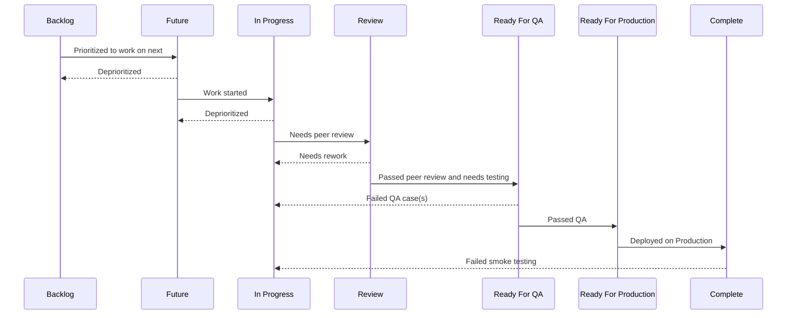

# Proposed task status and flows

## Communication Principles
- **Target no more than 5 tickets per board, per status category.** If there's more, task must be either deployed or put back in the backlog.
- **If you're finished with a stage, it's YOUR responsibility to assign it to the next person:** If you don't know who that is, ASK your manager or the team.
- **Whoever creates the ticket is the assumed owner of the ticket:** Unless specified otherwise. The owner's job is to sheperd the ticket to completion. 
- **Don't assume automated notifications are read:** Priority tickets should have redudant communication via Slack 
- **Always Acknowledge handoffs:** It takes two seconds and it's a great way to initiate a conversation for any clarification.
- **Tickets Without Testing Instructions Don't Get QAed:** Test cases should be created as early as possible - ideally with the ticket creation.

## Status definitions
- **Backlog**: Distant future work (more than 2 weeks)
- **Future**: Work in next 2 weeks (or fewer)
- **In Progress**: Current work
- **Review**: Needs review
- **Ready for QA**: Needs testing or retesting
- **Ready For Production**: Needs to be merged and released
- **Complete**: Deployed in production

