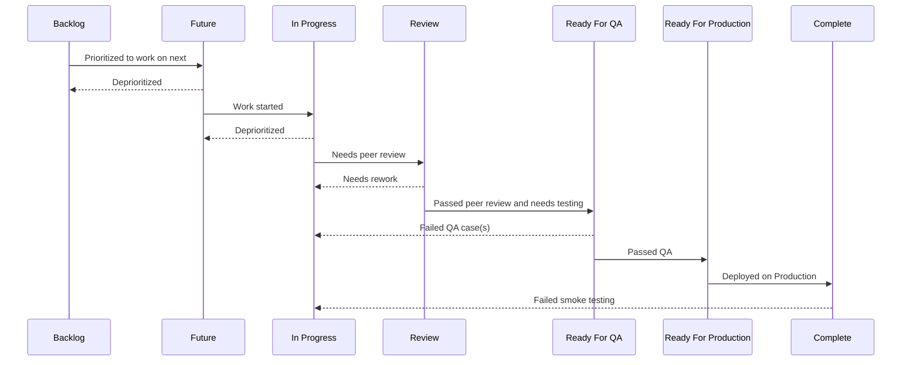

# sandbox

Backlog: Distant future work (more than 2 weeks)
Future: Work in next 2 weeks (or fewer)
In Progress: Current work
Review: In process of being reviewed
In QA: In process of being reviewed
Ready For Production: Needs to be merged and released
Complete: Deployed in production

